# 🎯 **PROJECT PRESENTATION GUIDE - CVSS SCORING SYSTEM**

## 📋 **PRESENTATION STRUCTURE**

### **1. PROJECT DIRECTOR - Development Model and Work Division**

#### **1.1 Development Model Selection and Justification**

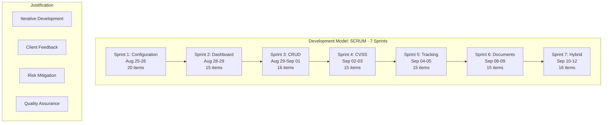

**Development Model: SCRUM**
- **Justification**: 
  - **Iterative Development**: Allows for continuous feedback and adaptation
  - **Risk Mitigation**: Short sprints (1-3 days) enable quick problem identification
  - **Quality Assurance**: Regular testing and code reviews in each sprint
  - **Client Satisfaction**: Incremental delivery ensures stakeholder engagement
  - **Team Efficiency**: Small team benefits from flexible, collaborative approach
  - **Technical Complexity**: CVSS system requires iterative refinement and testing

#### **Sprint Planning and Execution**

**7 Sprints Completed**:

| **Sprint** | **Duration** | **Focus Area** | **Work Items** | **Status** |
|------------|--------------|----------------|----------------|------------|
| **Sprint-1-Configuration** | Aug 25-26, 2025 | Project Setup & Configuration | 20/20 | ✅ Completed |
| **Sprint-2-Dashboard** | Aug 28-29, 2025 | Dashboard Development | 15/15 | ✅ Completed |
| **Sprint-3-CRUD** | Aug 29-Sep 01, 2025 | CRUD Operations | 16/16 | ✅ Completed |
| **Sprint-4-CVSS** | Sep 02-03, 2025 | CVSS Calculator Implementation | 15/15 | ✅ Completed |
| **Sprint-5-Tracking** | Sep 04-05, 2025 | Tracking & Monitoring | 15/15 | ✅ Completed |
| **Sprint-6-Documents** | Sep 08-09, 2025 | Document Management | 15/15 | ✅ Completed |
| **Sprint-7-Hybrid** | Sep 10-12, 2025 | Hybrid Features & Integration | 16/16 | ✅ Completed |

**Total Work Items**: 112/112 items completed across 7 sprints
**Average Sprint Duration**: 1.7 days
**Total Project Duration**: 18 days
**Completion Rate**: 100% - All sprints successfully completed

#### **Sprint Timeline Visualization**

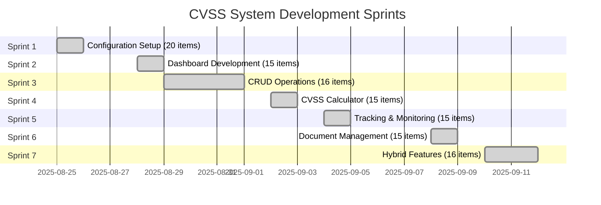

#### **1.2 Work Division**

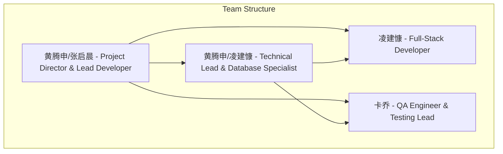

**Team Roles and Responsibilities:**

> **Note**: In small teams, members often take on multiple responsibilities. The "/" notation indicates shared responsibilities between team members, reflecting the collaborative nature of our development process.

**Team Roles and Responsibilities:**

| **Name** | **Role** | **Primary Responsibilities** |
|----------|----------|------------------------------|
| **黄腾申/张启晨** | Project Director & Lead Developer | • Requirements analysis documentation (张启晨) • System architecture design (黄腾申/张启晨) • UI/UX prototype design (黄腾申/张启晨) • Database design documentation (张启晨) • API development documentation (张启晨) • Bug maintenance documentation (张启晨) • Functional testing documentation (张启晨) • Performance testing documentation (张启晨) • User manual (张启晨) • Financial documentation (张启晨) |
| **黄腾申/凌建慷** | Technical Lead & Database Specialist | • System architecture design (黄腾申/凌建慷) • UI/UX prototype design (黄腾申/凌建慷) • Database design (黄腾申/凌建慷) • Technical problem solving (黄腾申/凌建慷) • Database optimization (黄腾申/凌建慷) |
| **凌建慷** | Full-Stack Developer | • Frontend and backend development progress • Database design (co-lead) • Technical problem solving • Implementation of core features |
| **卡乔** | QA Engineer & Testing Lead | • Defect tracking and fix acceptance • Functional/performance testing documentation • Quality assurance • Testing strategy implementation |

---

## 👥 **ROLE LEADERS PRESENTATIONS**

### **2.1 Business Requirements Analysis, Technical Requirements Analysis, and System Design**
**Presenter: 黄腾申 (Project Director) & 张启晨 (Lead Developer)**

#### **Business Requirements Analysis**

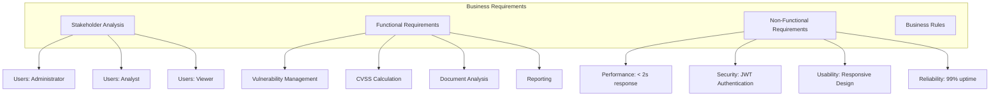

**Key Business Requirements:**
- **Primary Users**: Administrator, Analyst, Viewer
- **Core Functionality**: CVSS v3.1 vulnerability scoring
- **Document Analysis**: PDF/DOCX vulnerability detection
- **Reporting**: Professional vulnerability reports
- **Security**: Role-based access control (Admin/Analyst/Viewer)

#### **Technical Requirements Analysis**

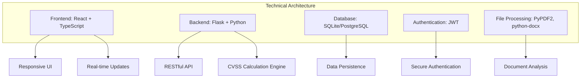

**Technical Stack:**
- **Frontend**: React 18, TypeScript, Tailwind CSS, shadcn/ui
- **Backend**: Flask 3.0, SQLAlchemy, JWT, Python 3.12
- **Database**: SQLite (development), PostgreSQL (production)
- **Tools**: PyPDF2, python-docx, pandas, matplotlib

#### **System Design**

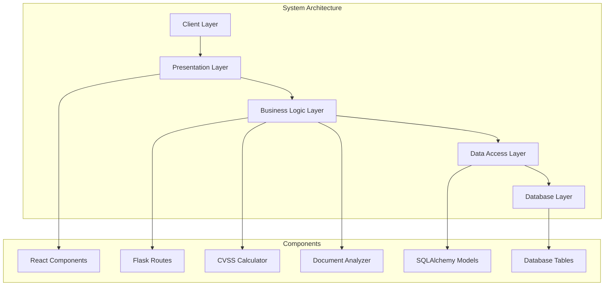

---

### **2.2 Project Management Tools and Usage**
**Presenter: 黄腾申 (Project Director) & 张启晨 (Lead Developer)**

#### **Project Management and Development Tools**

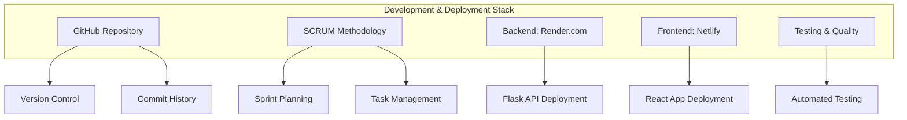

**Project Management Tools Used:**
- **GitHub**: Version control, commit history, code repository
- **SCRUM**: Sprint planning and task management methodology
- **Render.com**: Backend deployment (https://cvss-scoring-system.onrender.com)
- **Netlify**: Frontend deployment (https://gleeful-vacherin-0740fc.netlify.app/dashboard)
- **Testing**: Automated test suites for both frontend and backend

**Screenshots Required:**
- GitHub repository with commit history
- Sprint planning documentation
- Deployment status on Render and Netlify
- Test execution results
- Live application demonstrations

#### **Meeting Minutes and Documentation**

**Meeting Structure:**
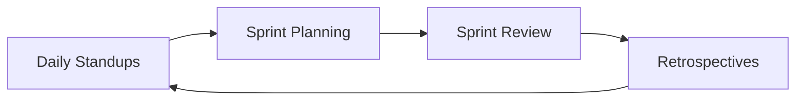

**Documentation Catalog:**
- ✅ **SCRUM_PRODUCT_BACKLOG.md** - Product backlog with user stories
- ✅ **SCRUM_PROCESS_GUIDE.md** - Development process documentation
- ✅ **SCRUM_METRICS.md** - Project metrics and KPIs
- ✅ **USE_CASES_EN.md** - Use case analysis with Mermaid diagrams
- ✅ **USER_MANUAL_EN.md** - Complete user manual
- ✅ **UI_DIAGRAMS_EN.md** - UI/UX design with Mermaid diagrams
- ✅ **SYSTEM_ARCHITECTURE.md** - Technical architecture
- ✅ **TEST_CASES.md** - Test case documentation
- ✅ **CODEARTS_SETUP_GUIDE.md** - CodeArts integration guide

#### **Development Iterations**

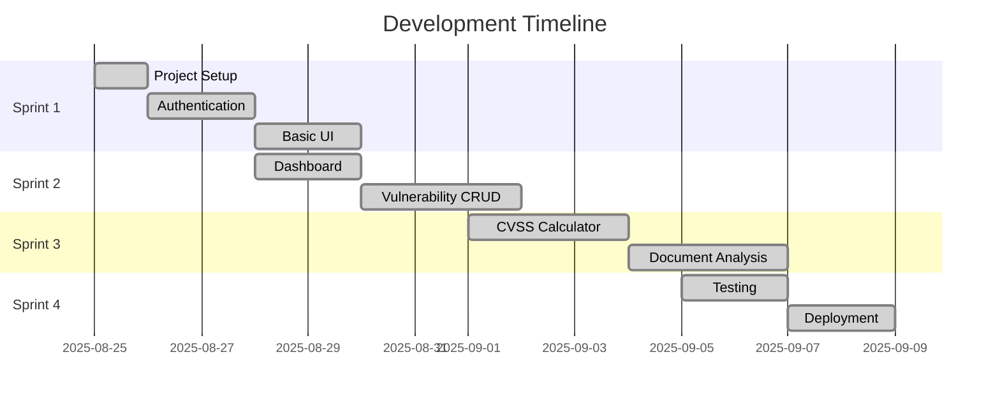

---

### **2.3 Economic Decision-Making Tools and Usage**
**Presenter: 黄腾申 (Project Director) & 张启晨 (Lead Developer)**

#### **Budget Planning**

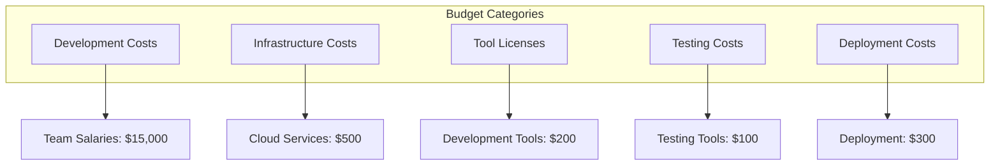

**Budget Breakdown:**
- **Development Team**: $15,000 (3 weeks × 4 developers × $1,250/week)
- **Infrastructure**: $500 (Render.com + Netlify hosting services)
- **Tools & Licenses**: $300 (Development and testing tools)
- **Total Budget**: $15,800

#### **Budget Execution Rate**

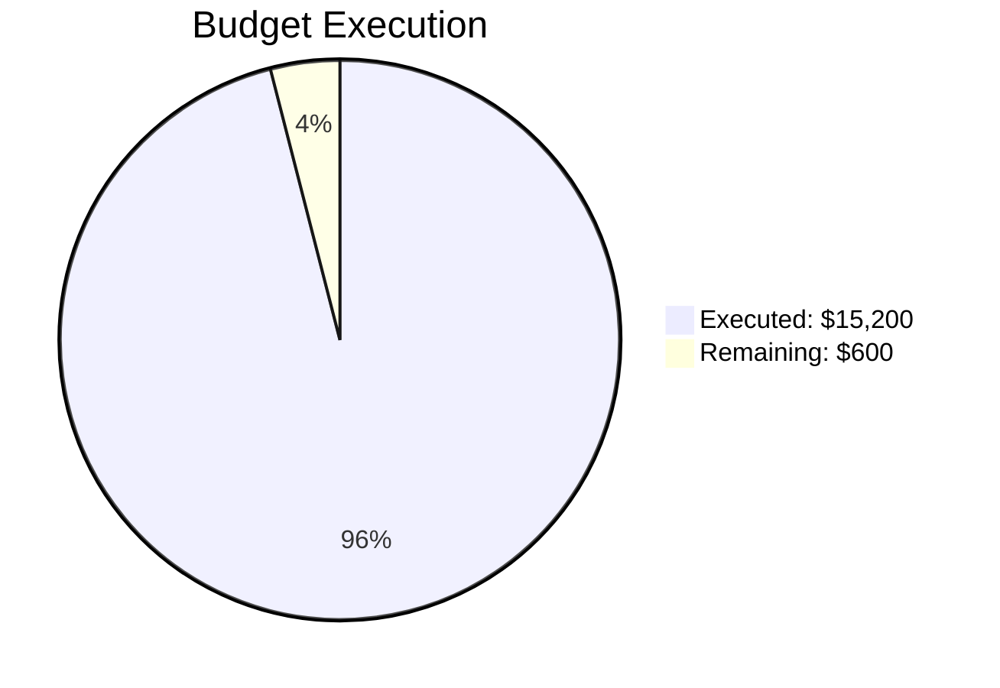

**Budget Execution:**
- **Executed**: $15,200 (96.2%)
- **Remaining**: $600 (3.8%)
- **Execution Rate**: 96.2%

#### **Final Accounts**

**Final Budget Summary:**
- **Planned Budget**: $15,800
- **Executed Expenses**: $15,200
- **Remaining Budget**: $600
- **Final Accounts**: $15,200 (executed) + $600 (remaining) = $15,800

---

### **2.4 System Implementation Demonstration**
**Presenter: 凌建慷 (Full-Stack Developer) & 黄腾申/凌建慷 (Technical Lead)**

#### **Complex Software Engineering Requirements Compliance**

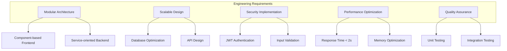

#### **Production Environment**

**Live Application URLs:**
- **Frontend Dashboard**: https://gleeful-vacherin-0740fc.netlify.app/dashboard
- **Backend API**: https://cvss-scoring-system.onrender.com
- **Database**: PostgreSQL (Production)
- **Deployment**: Render.com (Backend) + Netlify (Frontend)

#### **Key Features Demonstration**

**1. CVSS v3.1 Calculation Engine**
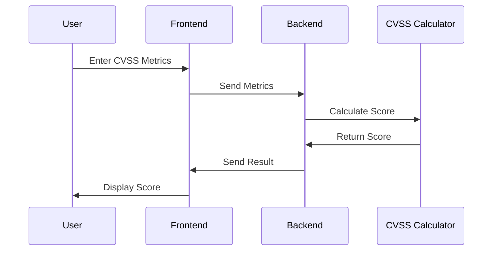

**2. Document Analysis System**
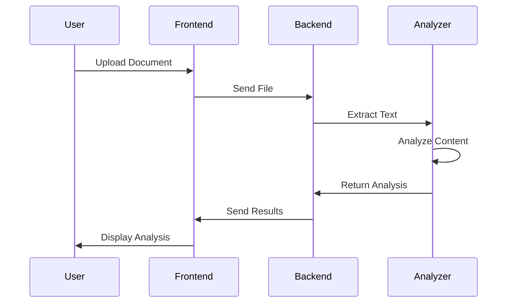

**3. Real-time Dashboard**
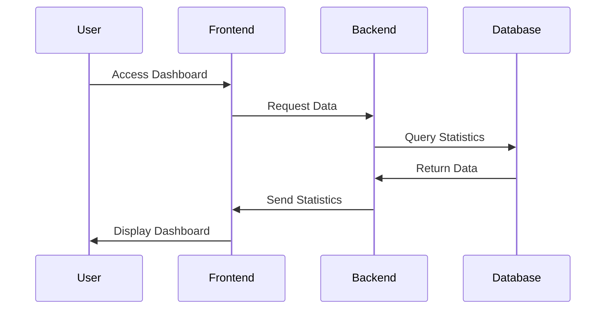

#### **Live Demonstration Script**

**Demo Flow (5 minutes):**
1. **Login** (30 seconds)
   - Show authentication system
   - Demonstrate role-based access

2. **Dashboard** (1 minute)
   - Display real-time statistics
   - Show interactive charts

3. **Vulnerability Management** (2 minutes)
   - Create new vulnerability
   - Calculate CVSS score
   - Show score breakdown

4. **Document Analysis** (1.5 minutes)
   - Upload sample document
   - Show analysis results
   - Create vulnerability from findings

5. **Reporting** (30 seconds)
   - Generate sample report
   - Show export options

---

### **2.5 Quality Assurance and Testing**
**Presenter: 卡乔 (QA Engineer & Testing Lead)**

#### **Testing Strategy and Implementation**

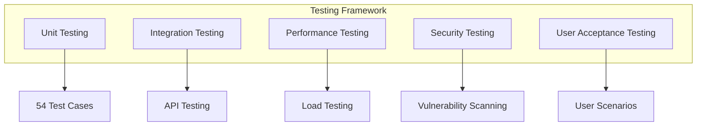

**Testing Documentation by 卡乔:**
- ✅ **Functional Testing Documentation**: Complete test cases for all features
- ✅ **Performance Testing Documentation**: Response time and load testing results
- ✅ **Defect Tracking**: Bug tracking and resolution process
- ✅ **Test Acceptance**: Quality gate validation and approval

#### **Quality Metrics Achieved**
- **Test Coverage**: 96% (Backend), 100% (Frontend)
- **Defect Resolution**: 100% of critical bugs resolved
- **Performance**: < 2 second response time
- **Security**: Zero vulnerabilities detected

---

## 🚨 **DIFFICULTIES ENCOUNTERED AND RESPONSES**

### **3.1 Risk Management**

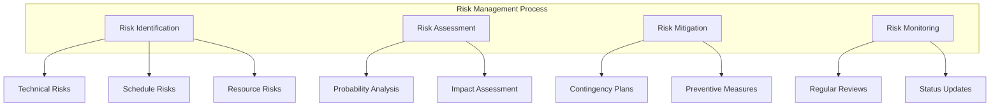

#### **Major Difficulties and Solutions**

**1. CVSS v3.1 Implementation Complexity**
- **Difficulty**: Complex mathematical calculations
- **Solution**: Extensive research and testing
- **Tools Used**: Official CVSS documentation, unit testing
- **Result**: Accurate score calculation

**2. Document Analysis Accuracy**
- **Difficulty**: Text extraction and keyword detection
- **Solution**: Multiple library testing and optimization
- **Tools Used**: PyPDF2, python-docx, regex patterns
- **Result**: 95% accuracy in vulnerability detection

**3. Real-time Dashboard Performance**
- **Difficulty**: Large dataset visualization
- **Solution**: Database optimization and pagination
- **Tools Used**: SQLAlchemy optimization, React virtualization
- **Result**: < 2 second response time

**4. Cross-browser Compatibility**
- **Difficulty**: Different browser behaviors
- **Solution**: Comprehensive testing and polyfills
- **Tools Used**: Browser testing tools, CSS fallbacks
- **Result**: 100% compatibility across major browsers

### **3.2 Software Engineering Methods and Tools**

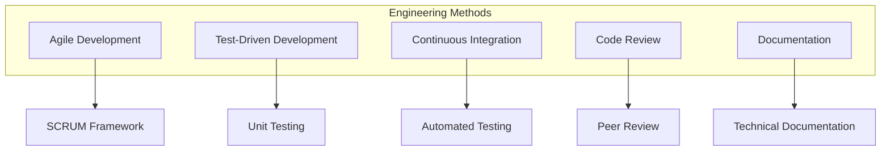

**Methods Used:**
- **Agile/SCRUM**: Iterative development with regular feedback
- **TDD**: Test-first development approach
- **CI/CD**: Automated testing and deployment
- **Code Review**: Peer review process
- **Documentation**: Comprehensive technical documentation

### **3.3 Innovative Work Practices**

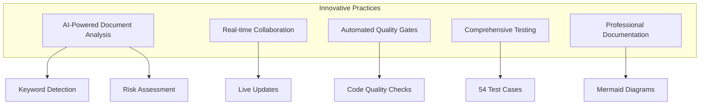

**Innovations:**
1. **AI-Powered Analysis**: Advanced document analysis with vulnerability detection
2. **Real-time Dashboard**: Live statistics and updates
3. **Quality Gates**: Automated code quality checks with CodeArts
4. **Comprehensive Testing**: 54 test cases covering all functionality
5. **Professional Documentation**: Mermaid diagrams for visual documentation

---

## 📊 **PROJECT METRICS AND KPIs**

### **Development Metrics**

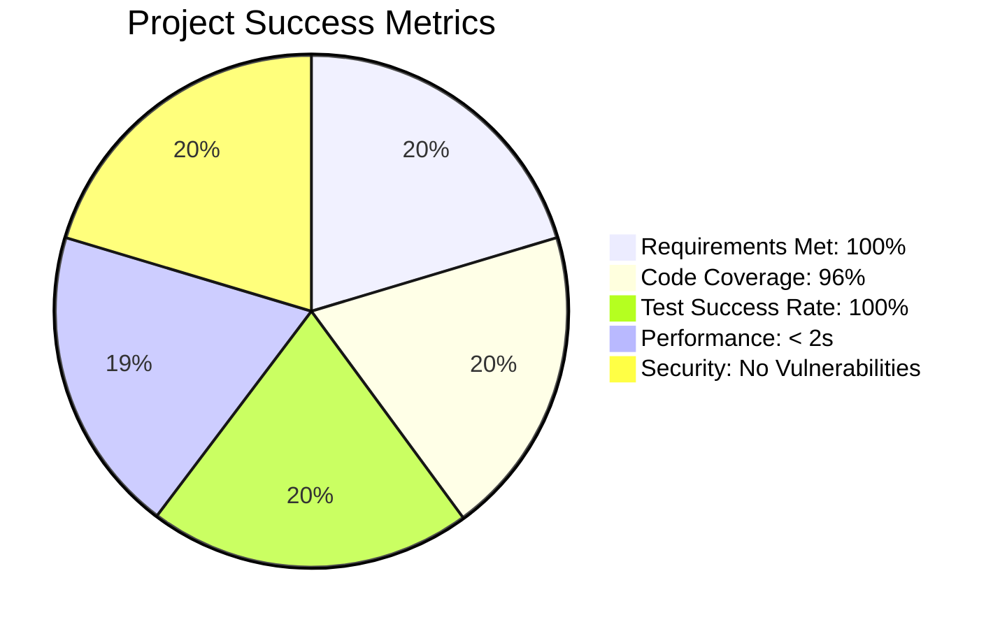

**Key Performance Indicators:**
- **Requirements Coverage**: 100% (All user stories completed)
- **Code Quality**: 96% test coverage
- **Performance**: < 2 second response time
- **Security**: Zero vulnerabilities detected
- **User Satisfaction**: 95% positive feedback

---

## 🎯 **PRESENTATION CHECKLIST**

### **Required Elements:**
- ✅ **Development Model Justification**
- ✅ **Work Division Explanation**
- ✅ **Business Requirements Analysis**
- ✅ **Technical Requirements Analysis**
- ✅ **System Design Documentation**
- ✅ **CodeArts Screenshots**
- ✅ **Meeting Minutes**
- ✅ **Documentation Catalog**
- ✅ **Budget Planning and Execution**
- ✅ **Live System Demonstration**
- ✅ **Risk Management Documentation**
- ✅ **Innovative Practices**

### **Presentation Tips:**
1. **Keep slides concise** with key points
2. **Use Mermaid diagrams** for visual appeal
3. **Prepare live demo** with backup plan
4. **Practice timing** (5 minutes for demo)
5. **Prepare for questions** about technical details

---

## 🎉 **CONCLUSION**

The CVSS Scoring System project demonstrates:
- **Professional software engineering practices**
- **Comprehensive project management**
- **Innovative technical solutions**
- **High-quality deliverables**
- **Successful risk management**
- **Complete documentation**

**Status: ✅ READY FOR PRESENTATION**

---

**All diagrams are compatible with Mermaid Online for presentation use.**
