# 🎨 **USER INTERFACE DIAGRAMS - CVSS SCORING SYSTEM**

## 📋 **GENERAL INFORMATION**
- **Project:** CVSS Scoring System
- **Version:** 1.0
- **Date:** September 2025
- **Framework:** React + TypeScript
- **Styling:** Tailwind CSS + shadcn/ui
- **Responsive:** Mobile-first design

---

## 🎯 **DESIGN PRINCIPLES**

### **Design System:**
- **Colors:** Professional palette with blues and grays
- **Typography:** Inter font family
- **Spacing:** 8px system (0.5rem, 1rem, 1.5rem, 2rem, etc.)
- **Components:** shadcn/ui as base
- **Icons:** Lucide React
- **Animations:** Framer Motion

### **Color Palette:**
```css
/* Primary Colors */
--primary: #3b82f6;      /* Blue-500 */
--primary-dark: #2563eb; /* Blue-600 */
--primary-light: #60a5fa; /* Blue-400 */

/* Secondary Colors */
--secondary: #64748b;    /* Slate-500 */
--secondary-dark: #475569; /* Slate-600 */
--secondary-light: #94a3b8; /* Slate-400 */

/* Status Colors */
--success: #10b981;      /* Emerald-500 */
--warning: #f59e0b;      /* Amber-500 */
--error: #ef4444;        /* Red-500 */
--info: #06b6d4;         /* Cyan-500 */

/* Neutral Colors */
--background: #ffffff;   /* White */
--surface: #f8fafc;      /* Slate-50 */
--border: #e2e8f0;       /* Slate-200 */
--text: #1e293b;         /* Slate-800 */
--text-muted: #64748b;   /* Slate-500 */
```

---

## 🏗️ **APPLICATION ARCHITECTURE**

### **Component Hierarchy**

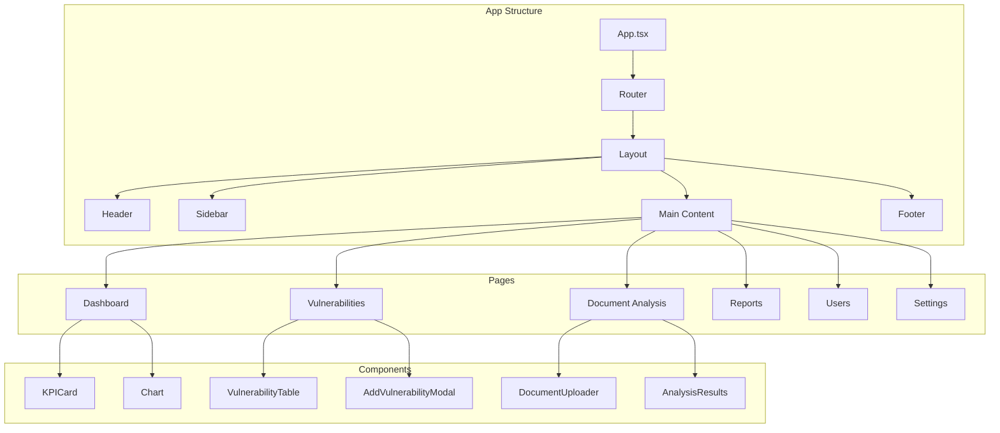

---

## 🏠 **DASHBOARD LAYOUT**

### **Dashboard Structure**

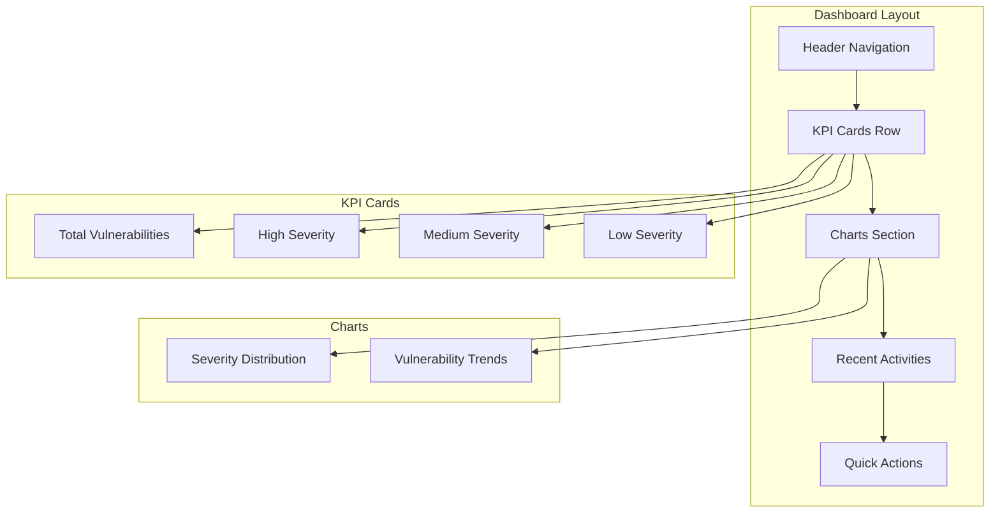

### **Dashboard Wireframe**

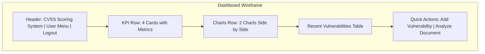

---

## 🔍 **VULNERABILITY MANAGEMENT**

### **Vulnerability List Layout**

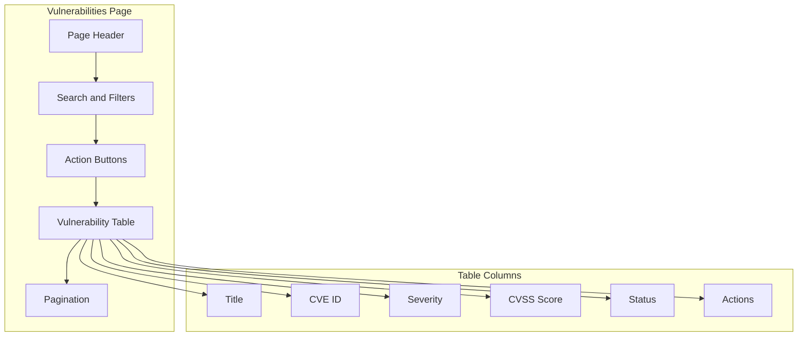

### **Add Vulnerability Modal**

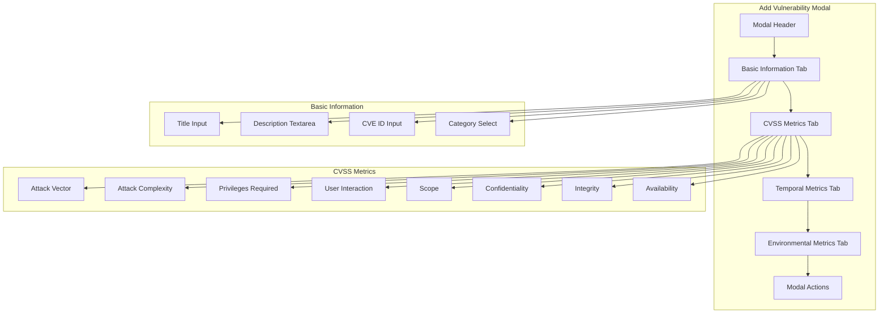

---

## 📄 **DOCUMENT ANALYSIS**

### **Document Analysis Layout**

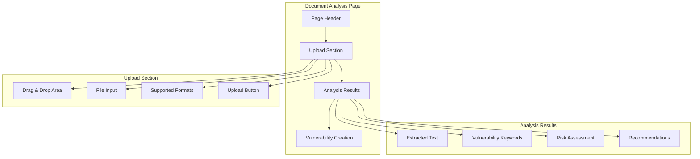

### **Analysis Results Display**

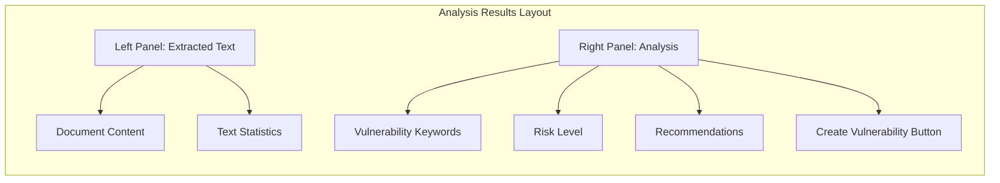

---

## 📊 **REPORT GENERATION**

### **Report Generation Layout**

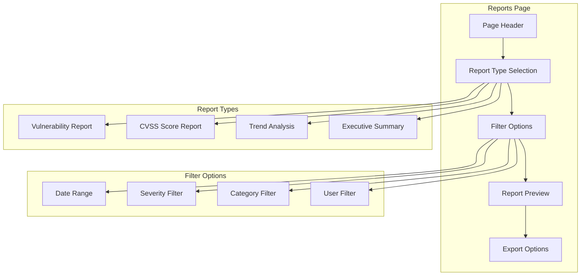

---

## 👥 **USER MANAGEMENT**

### **User Management Layout**

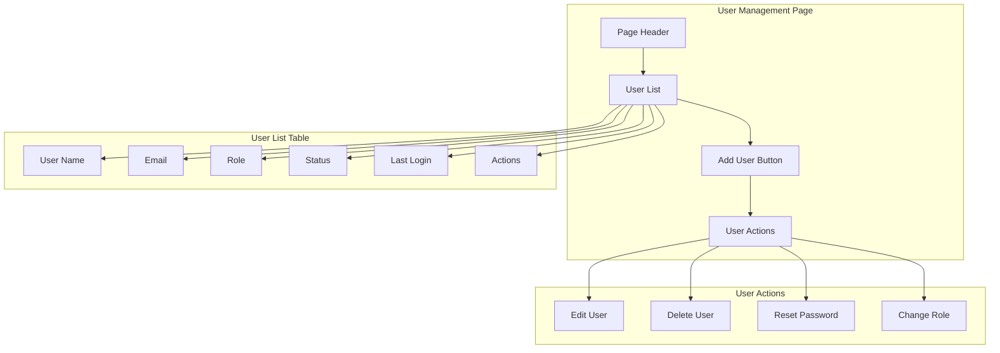

### **Add/Edit User Modal**

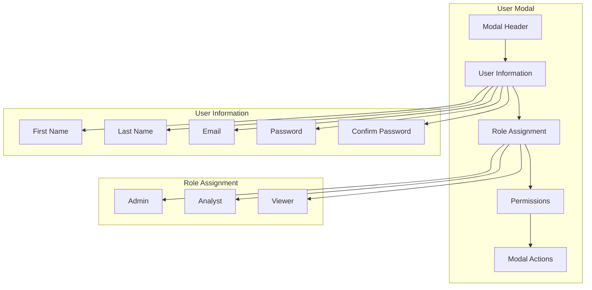

---

## 🗄️ **DATABASE MANAGEMENT**

### **Database Manager Layout**

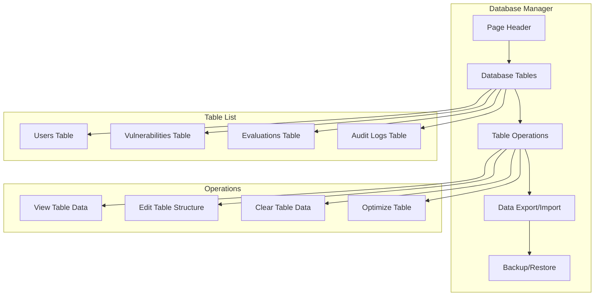

---

## 📋 **AUDIT LOGS**

### **Audit Logs Layout**

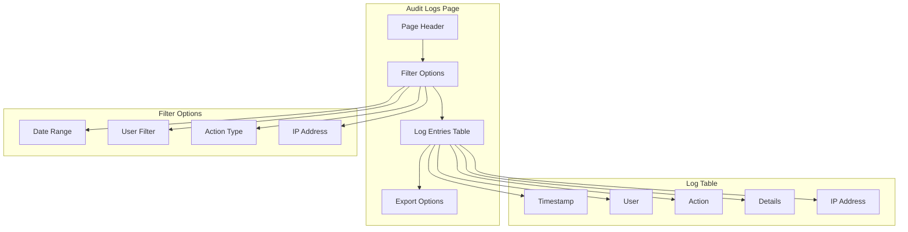

---

## 🔧 **SETTINGS PAGE**

### **Settings Layout**

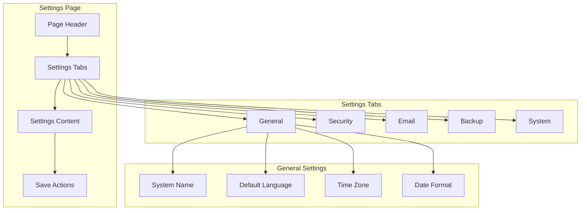

---

## 📱 **RESPONSIVE DESIGN**

### **Breakpoints**

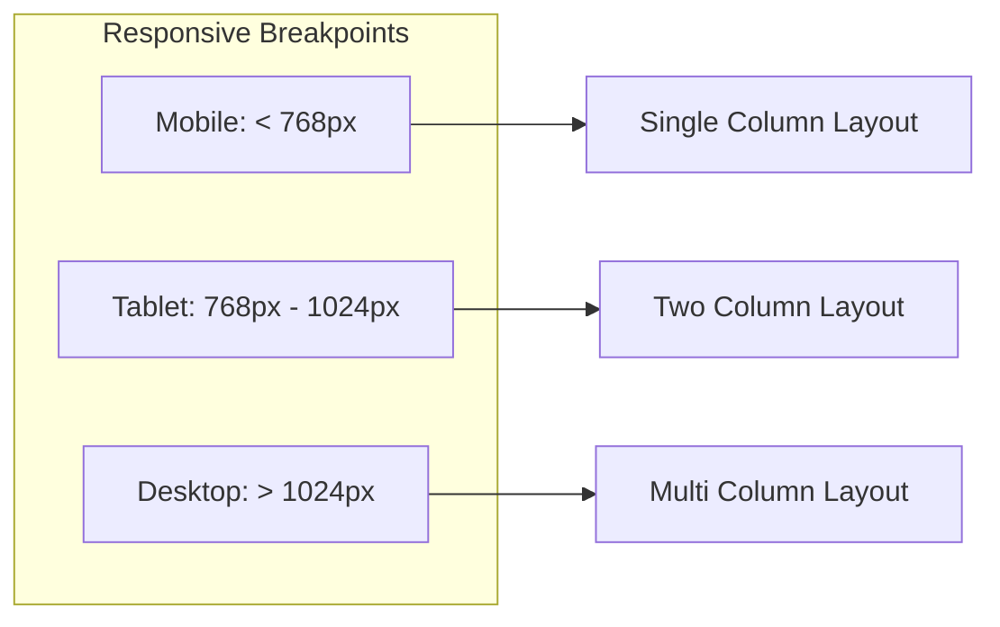

### **Mobile Layout**

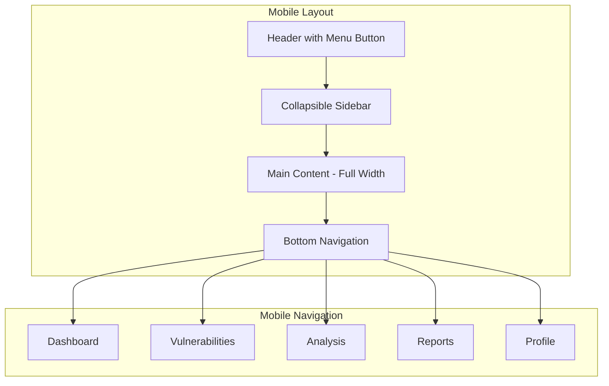

---

## 🎨 **COMPONENT LIBRARY**

### **UI Components**

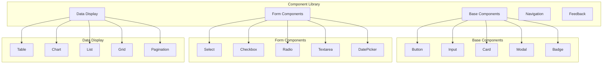

---

## 🚀 **NAVIGATION FLOW**

### **User Journey**

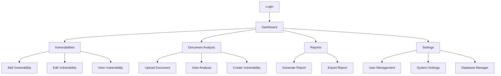

---

## 🎯 **ACCESSIBILITY FEATURES**

### **Accessibility Compliance**

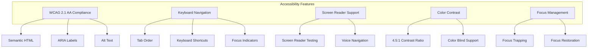

---

## 📊 **PERFORMANCE METRICS**

### **UI Performance**

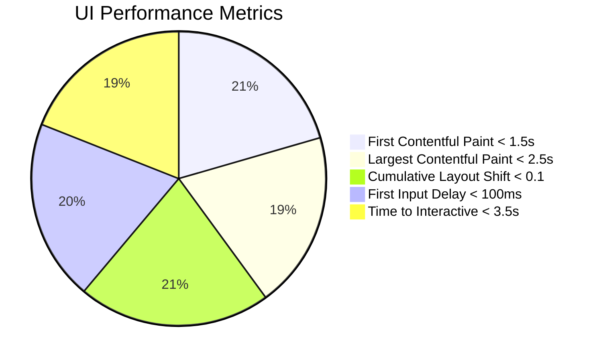

---

## 🎉 **CONCLUSION**

The CVSS Scoring System UI provides:
- **Modern, responsive design**
- **Intuitive user experience**
- **Accessibility compliance**
- **Professional appearance**
- **Mobile-first approach**
- **Component-based architecture**

**Status: ✅ COMPLETED - All UI components designed and implemented**

---

**All diagrams are compatible with Mermaid Online for easy viewing and editing.**
