# 📖 User Manual - CVSS Scoring System

## 🎯 **Introduction**

The **CVSS Scoring System** is a comprehensive web application for evaluating and managing security vulnerabilities using the CVSS v3.1 standard. This manual will guide you through all system functionalities.

## 🚀 **System Access**

### **Access URLs**
- **Local System**: http://localhost:3001
- **Deployed System**: https://your-site.netlify.app

### **Default Credentials**
- **Email**: admin@cvss.com
- **Password**: admin123
- **Role**: Administrator

## 🔐 **Authentication System**

### **User Roles**

#### **👑 Administrator (Admin)**
- ✅ Full access to all functionalities
- ✅ User management
- ✅ Database Manager
- ✅ System configuration
- ✅ Complete audit trail

#### **🔍 Analyst (Analyst)**
- ✅ Create and edit vulnerabilities
- ✅ Perform CVSS evaluations
- ✅ Analyze documents
- ✅ Generate reports
- ❌ User management
- ❌ Database Manager

#### **👁️ Viewer (Viewer)**
- ✅ View vulnerabilities
- ✅ View evaluations
- ✅ View reports
- ❌ Create or edit content
- ❌ Analyze documents

### **Login Process**
1. Go to the login page
2. Enter your email and password
3. Click **"Sign In"**
4. You will be redirected to the main dashboard

## 🏠 **Main Dashboard**

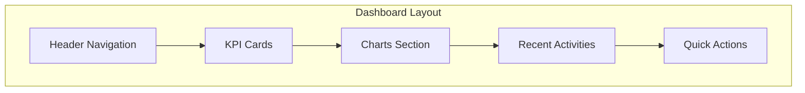

### **Dashboard Components**

#### **📊 KPI Cards**
- **Total Vulnerabilities**: Shows total count
- **High Severity**: Critical and High severity count
- **Medium Severity**: Medium severity count
- **Low Severity**: Low severity count

#### **📈 Charts**
- **Severity Distribution**: Pie chart showing severity breakdown
- **Vulnerability Trends**: Line chart showing trends over time
- **Recent Vulnerabilities**: Table with latest entries

## 🔍 **Vulnerability Management**

### **Creating a Vulnerability**

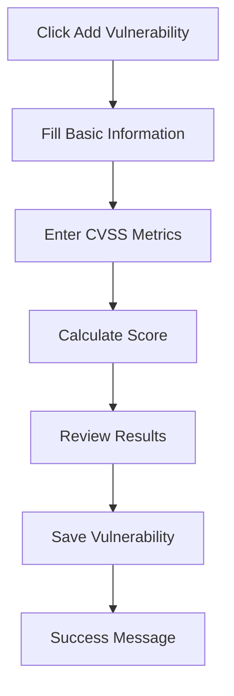

#### **Step-by-Step Process:**
1. **Navigate to Vulnerabilities**
   - Click "Vulnerabilities" in the main menu
   - Click "Add Vulnerability" button

2. **Basic Information**
   - **Title**: Vulnerability name
   - **Description**: Detailed description
   - **CVE ID**: Common Vulnerabilities and Exposures ID
   - **Category**: Vulnerability type

3. **CVSS Metrics**
   - **Attack Vector (AV)**: Network, Adjacent, Local, Physical
   - **Attack Complexity (AC)**: Low, High
   - **Privileges Required (PR)**: None, Low, High
   - **User Interaction (UI)**: None, Required
   - **Scope (S)**: Unchanged, Changed
   - **Confidentiality (C)**: None, Low, High
   - **Integrity (I)**: None, Low, High
   - **Availability (A)**: None, Low, High

4. **Temporal Metrics** (Optional)
   - **Exploit Code Maturity (E)**: Not Defined, Unproven, Proof-of-Concept, Functional, High
   - **Remediation Level (RL)**: Not Defined, Official Fix, Temporary Fix, Workaround, Unavailable
   - **Report Confidence (RC)**: Not Defined, Unknown, Reasonable, Confirmed

5. **Environmental Metrics** (Optional)
   - **Confidentiality Requirement (CR)**: Not Defined, Low, Medium, High
   - **Integrity Requirement (IR)**: Not Defined, Low, Medium, High
   - **Availability Requirement (AR)**: Not Defined, Low, Medium, High

### **CVSS Score Calculation**

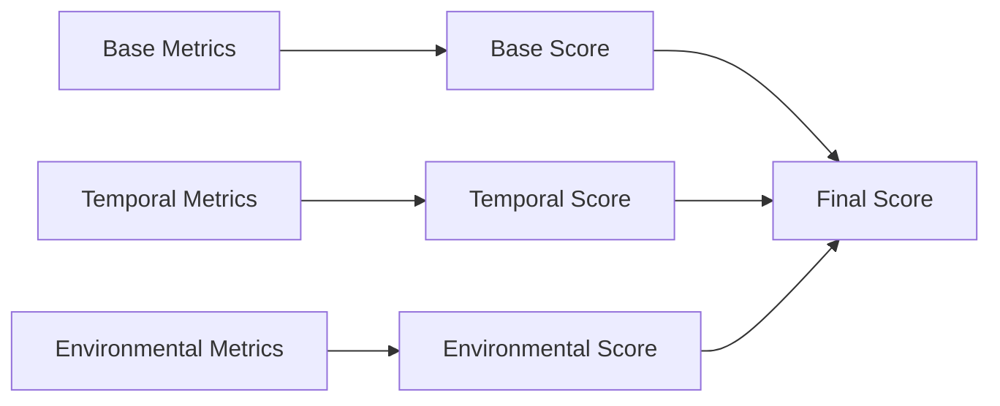

#### **Score Interpretation:**
- **0.0 - 3.9**: Low
- **4.0 - 6.9**: Medium
- **7.0 - 8.9**: High
- **9.0 - 10.0**: Critical

## 📄 **Document Analysis**

### **Supported File Types**
- **PDF**: Portable Document Format
- **DOCX**: Microsoft Word documents

### **Analysis Process**

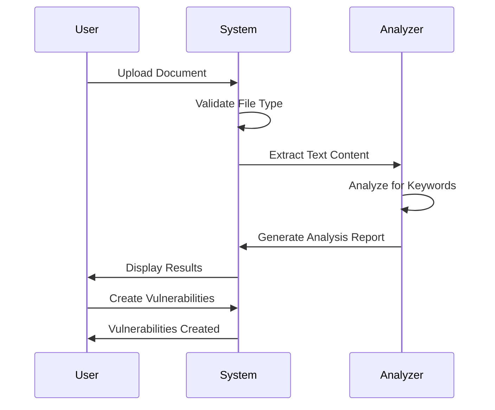

#### **Step-by-Step Process:**
1. **Upload Document**
   - Click "Document Analysis" in the menu
   - Click "Upload Document"
   - Select PDF or DOCX file
   - Click "Analyze"

2. **Analysis Results**
   - **Extracted Text**: Full document content
   - **Vulnerability Keywords**: Detected security terms
   - **Risk Assessment**: Potential security issues
   - **Recommendations**: Suggested actions

3. **Create Vulnerabilities**
   - Review analysis results
   - Select relevant findings
   - Click "Create Vulnerability"
   - Fill in additional details
   - Save vulnerability

## 📊 **Report Generation**

### **Report Types**

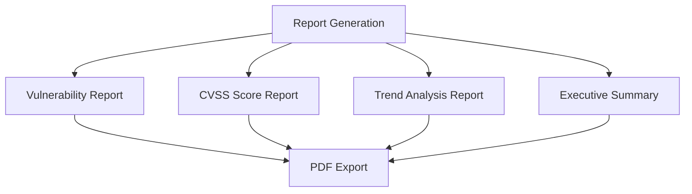

#### **Available Reports:**
1. **Vulnerability Report**
   - List of all vulnerabilities
   - Filtered by date range, severity, category
   - Detailed CVSS scores

2. **CVSS Score Report**
   - Score distribution analysis
   - Trend over time
   - Comparison by category

3. **Trend Analysis Report**
   - Vulnerability trends
   - Severity distribution changes
   - Monthly/quarterly summaries

4. **Executive Summary**
   - High-level overview
   - Key metrics
   - Recommendations

### **Generating Reports**
1. **Select Report Type**
   - Go to "Reports" section
   - Choose report type

2. **Set Filters**
   - Date range
   - Severity levels
   - Categories
   - Users

3. **Generate Report**
   - Click "Generate Report"
   - Wait for processing
   - Download PDF or Excel file

## 👥 **User Management** (Admin Only)

### **User Operations**

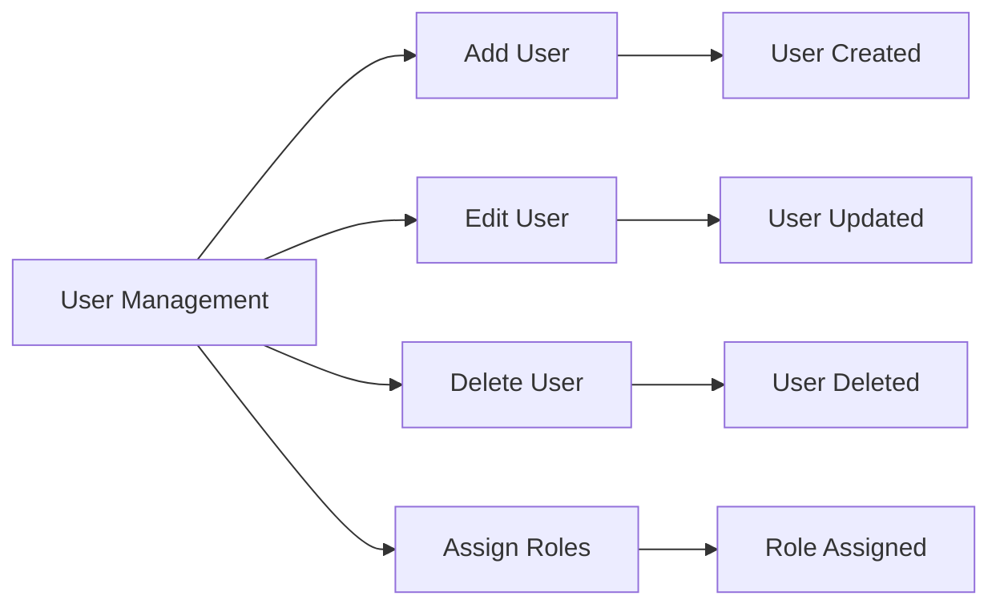

#### **Managing Users:**
1. **Access User Management**
   - Click "Users" in admin menu
   - View user list

2. **Add New User**
   - Click "Add User"
   - Fill user details
   - Assign role
   - Set permissions

3. **Edit User**
   - Click user name
   - Modify details
   - Update role
   - Save changes

4. **Delete User**
   - Select user
   - Click "Delete"
   - Confirm action

## 🗄️ **Database Management** (Admin Only)

### **Database Operations**

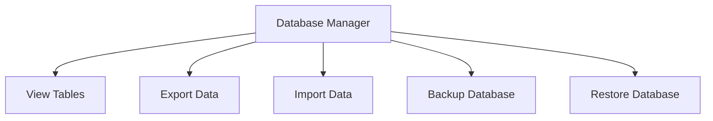

#### **Available Operations:**
1. **View Tables**
   - Browse all database tables
   - View table structure
   - Check data integrity

2. **Export Data**
   - Export to CSV
   - Export to JSON
   - Export to Excel

3. **Import Data**
   - Import from CSV
   - Import from JSON
   - Validate data format

4. **Backup/Restore**
   - Create database backup
   - Restore from backup
   - Schedule automatic backups

## 📋 **Audit Logs**

### **Audit Trail**

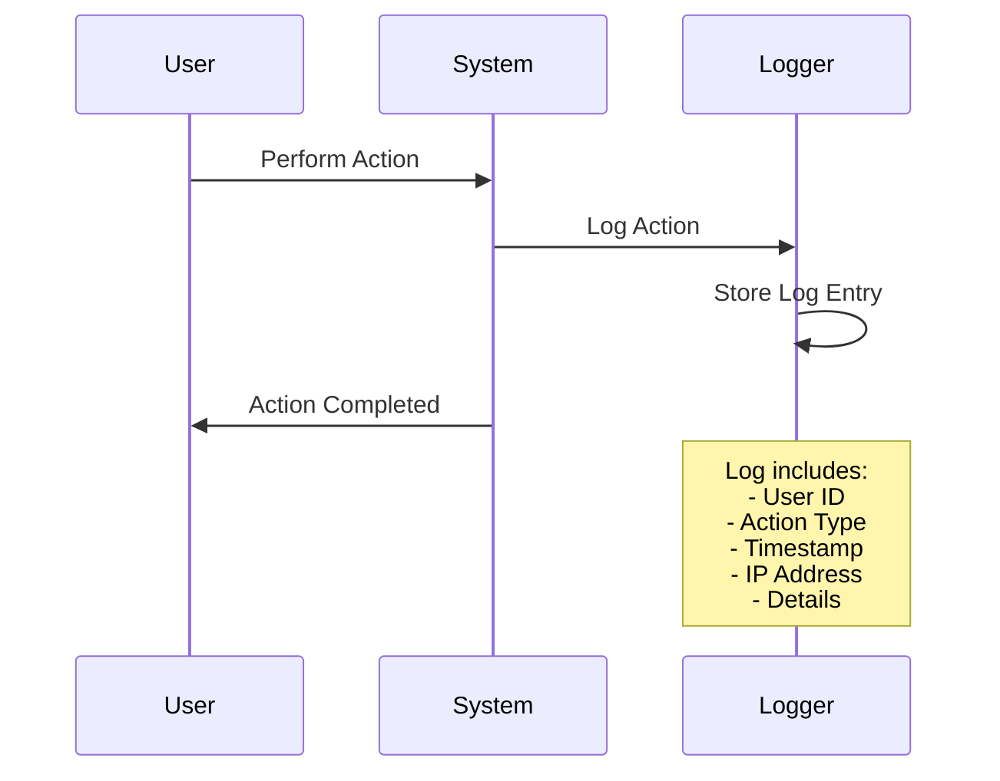

#### **Logged Activities:**
- User login/logout
- Vulnerability creation/modification
- Document analysis
- Report generation
- User management
- System configuration

#### **Viewing Audit Logs:**
1. **Access Audit Logs**
   - Click "Audit Logs" in admin menu
   - View log entries

2. **Filter Logs**
   - Filter by user
   - Filter by action type
   - Filter by date range

3. **Export Logs**
   - Export to CSV
   - Export to PDF
   - Print logs

## 🔧 **System Configuration**

### **Configuration Options**

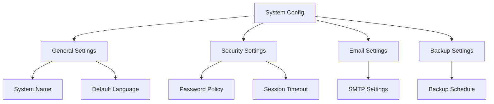

#### **Available Settings:**
1. **General Settings**
   - System name
   - Default language
   - Time zone
   - Date format

2. **Security Settings**
   - Password policy
   - Session timeout
   - Login attempts
   - Two-factor authentication

3. **Email Settings**
   - SMTP configuration
   - Email templates
   - Notification settings

4. **Backup Settings**
   - Backup schedule
   - Retention policy
   - Storage location

## 🚨 **Troubleshooting**

### **Common Issues**

#### **Login Problems**
- **Issue**: Cannot login
- **Solution**: Check credentials, reset password
- **Prevention**: Use strong passwords

#### **File Upload Issues**
- **Issue**: Document upload fails
- **Solution**: Check file format, size limits
- **Prevention**: Use supported formats only

#### **Performance Issues**
- **Issue**: Slow response times
- **Solution**: Check system resources
- **Prevention**: Regular maintenance

### **Error Messages**

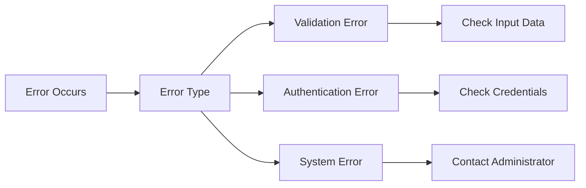

#### **Common Error Messages:**
- **"Invalid credentials"**: Check username/password
- **"File format not supported"**: Use PDF or DOCX
- **"Access denied"**: Check user permissions
- **"System error"**: Contact administrator

## 📞 **Support**

### **Getting Help**

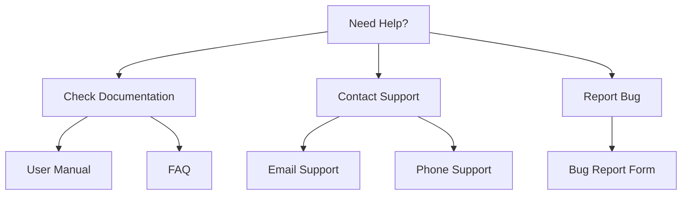

#### **Support Channels:**
1. **Documentation**
   - User Manual (this document)
   - FAQ section
   - Video tutorials

2. **Contact Support**
   - Email: support@cvss.com
   - Phone: +1-800-CVSS-HELP
   - Live chat: Available 9 AM - 5 PM EST

3. **Report Issues**
   - Bug report form
   - Feature request form
   - Feedback form

## 🎯 **Best Practices**

### **Security Best Practices**
- Use strong passwords
- Log out when finished
- Don't share credentials
- Report suspicious activity

### **Data Management**
- Regular backups
- Data validation
- Access control
- Audit trail maintenance

### **Performance Optimization**
- Regular system updates
- Monitor system resources
- Optimize database queries
- Clean up old data

## 📈 **System Metrics**

### **Performance Indicators**

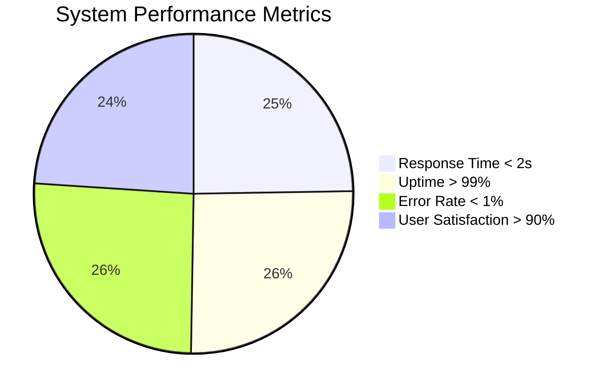

#### **Key Metrics:**
- **Response Time**: < 2 seconds
- **Uptime**: > 99%
- **Error Rate**: < 1%
- **User Satisfaction**: > 90%

## 🎉 **Conclusion**

The CVSS Scoring System provides a comprehensive solution for vulnerability management with:
- **Complete CVSS v3.1 support**
- **Document analysis capabilities**
- **Professional reporting**
- **User management**
- **Audit trail**
- **Responsive design**

**Status: ✅ READY FOR PRODUCTION USE**

---

**For additional support, contact: support@cvss.com**
