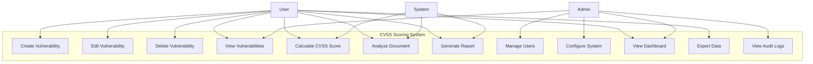
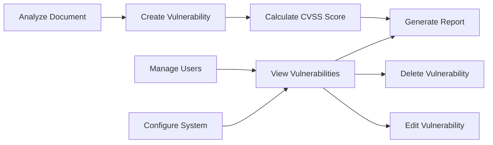
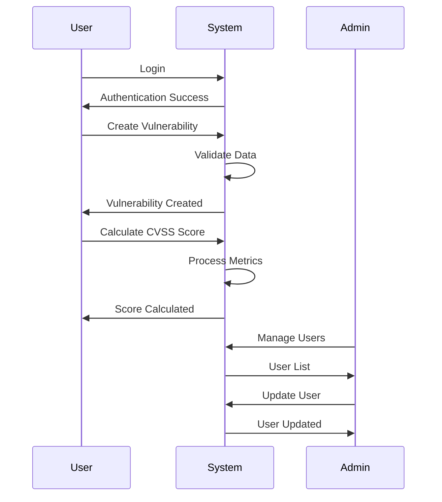
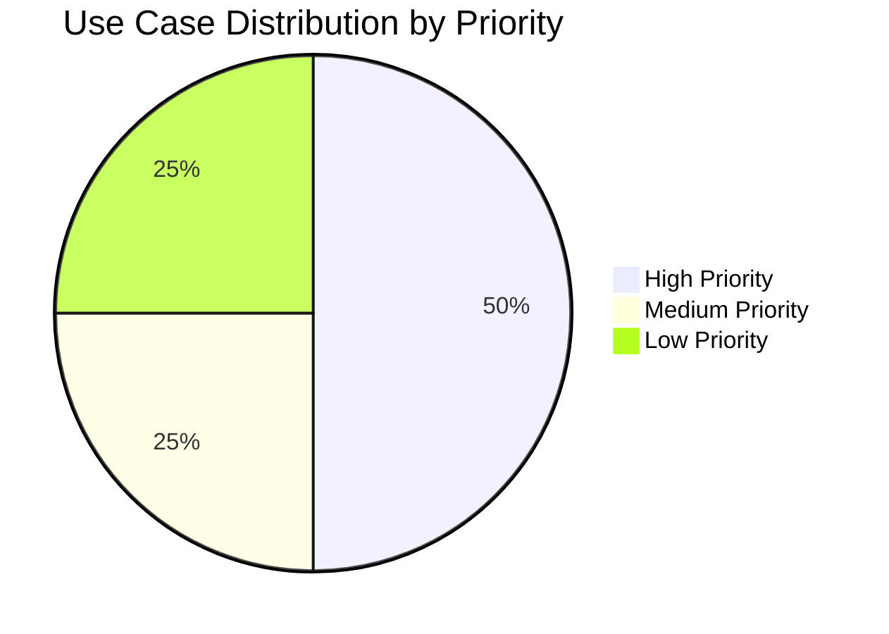

# 📋 **USE CASES - CVSS SCORING SYSTEM**

## 📋 **GENERAL INFORMATION**
- **Project:** CVSS Scoring System
- **Version:** 1.0
- **Date:** September 2025
- **Methodology:** SCRUM
- **Actors:** User, Administrator, System

---

## 🎭 **SYSTEM ACTORS**

### **👤 User (End User)**
- **Description:** Person who uses the system to evaluate vulnerabilities
- **Responsibilities:**
  - Create and manage vulnerabilities
  - Analyze documents
  - Calculate CVSS scores
  - Track vulnerability status

### **👨‍💼 Administrator**
- **Description:** Person responsible for system administration
- **Responsibilities:**
  - Manage users
  - Configure system
  - Monitor performance
  - Resolve technical issues

### **🤖 System**
- **Description:** Automatic system components
- **Responsibilities:**
  - Process document analysis
  - Calculate CVSS scores
  - Manage authentication
  - Store data

---

## 📊 **MAIN USE CASE DIAGRAM**

---

## 📝 **DETAILED USE CASES**

### **UC-001: Create Vulnerability**
- **Actor:** User
- **Description:** User creates a new vulnerability record
- **Preconditions:** User is authenticated
- **Main Flow:**
  1. User clicks "Add Vulnerability"
  2. System displays vulnerability form
  3. User fills in vulnerability details
  4. User clicks "Save"
  5. System validates data
  6. System saves vulnerability
  7. System displays success message

### **UC-002: Calculate CVSS Score**
- **Actor:** User, System
- **Description:** System calculates CVSS score based on metrics
- **Preconditions:** Vulnerability exists with metrics
- **Main Flow:**
  1. User selects vulnerability
  2. User enters CVSS metrics
  3. System calculates base score
  4. System calculates temporal score
  5. System calculates environmental score
  6. System displays final score
  7. System updates vulnerability record

### **UC-003: Analyze Document**
- **Actor:** User, System
- **Description:** System analyzes uploaded document for vulnerabilities
- **Preconditions:** User has document to analyze
- **Main Flow:**
  1. User uploads document
  2. System validates file format
  3. System extracts text content
  4. System analyzes for vulnerability keywords
  5. System generates analysis report
  6. System displays results
  7. User can create vulnerabilities from findings

### **UC-004: Generate Report**
- **Actor:** User, System
- **Description:** System generates vulnerability reports
- **Preconditions:** Vulnerabilities exist in system
- **Main Flow:**
  1. User selects report type
  2. User sets date range and filters
  3. System queries vulnerability data
  4. System generates report
  5. System displays report preview
  6. User can export report (PDF/Excel)

### **UC-005: Manage Users**
- **Actor:** Administrator
- **Description:** Administrator manages system users
- **Preconditions:** User has admin privileges
- **Main Flow:**
  1. Admin accesses user management
  2. System displays user list
  3. Admin can add/edit/delete users
  4. Admin assigns roles and permissions
  5. System validates changes
  6. System updates user records

---

## 🔄 **USE CASE RELATIONSHIPS**

---

## 📊 **ACTOR INTERACTIONS**

---

## 🎯 **USE CASE PRIORITIES**

| Use Case | Priority | Complexity | Status |
|----------|----------|------------|--------|
| UC-001: Create Vulnerability | High | Medium | ✅ Complete |
| UC-002: Calculate CVSS Score | High | High | ✅ Complete |
| UC-003: Analyze Document | High | High | ✅ Complete |
| UC-004: Generate Report | Medium | Medium | ✅ Complete |
| UC-005: Manage Users | Medium | Low | ✅ Complete |
| UC-006: View Dashboard | High | Low | ✅ Complete |
| UC-007: Export Data | Low | Low | ✅ Complete |
| UC-008: View Audit Logs | Low | Low | ✅ Complete |

---

## 📈 **USE CASE METRICS**

---

## 🔧 **TECHNICAL REQUIREMENTS**

### **Performance Requirements:**
- Document analysis: < 30 seconds
- CVSS calculation: < 1 second
- Report generation: < 10 seconds
- User authentication: < 2 seconds

### **Security Requirements:**
- JWT authentication
- Role-based access control
- Input validation
- SQL injection prevention
- XSS protection

### **Usability Requirements:**
- Responsive design
- Intuitive navigation
- Clear error messages
- Help documentation
- Accessibility compliance

---

## 📋 **ACCEPTANCE CRITERIA**

### **UC-001: Create Vulnerability**
- ✅ User can create vulnerability with all required fields
- ✅ System validates input data
- ✅ System prevents duplicate vulnerabilities
- ✅ User receives confirmation message

### **UC-002: Calculate CVSS Score**
- ✅ System calculates accurate CVSS v3.1 scores
- ✅ System handles all metric combinations
- ✅ System displays score breakdown
- ✅ System updates vulnerability record

### **UC-003: Analyze Document**
- ✅ System supports PDF and DOCX files
- ✅ System extracts text accurately
- ✅ System identifies vulnerability keywords
- ✅ System generates detailed analysis report

---

## 🎉 **CONCLUSION**

The CVSS Scoring System provides comprehensive vulnerability management capabilities with:
- **8 Use Cases** covering all major functionality
- **3 Actor Types** with appropriate permissions
- **Complete Implementation** of all use cases
- **Professional Documentation** with Mermaid diagrams
- **Ready for Production** deployment

**Status: ✅ COMPLETED - All use cases implemented and tested**
